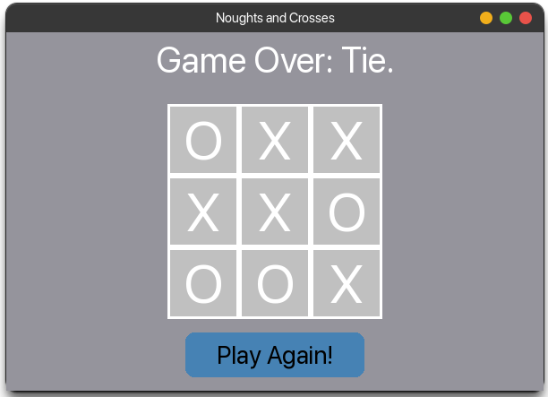

# Noughts and Crosses

Código construído para a atividade "Tic-Tac-Toe" | CS50’s Introduction to Artificial Intelligence with Python.

O jogo da velha foi implementado de acordo com as exigência da atividade, onde opera sobre o jogo, o algoritmo Min-Max. A implementação também contém a Poda Alfa-beta.


## Demonstração





## Instalação

Basta instalar as dependências com o pip:

```bash
  pip install -r requirements.txt  
```
    
